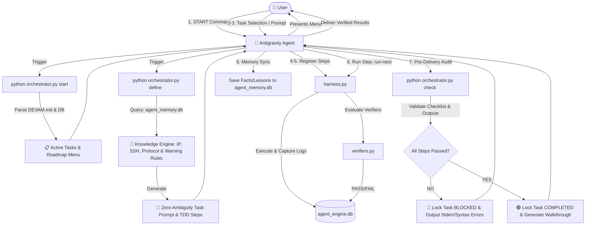

# Antigravity Graviton 🪐


[](https://opensource.org/licenses/Apache-2.0)
[](#)

**Antigravity Graviton** is a deterministic TDD (Test-Driven Development) governance harness and memory persistence plugin designed specifically for the **Google Antigravity** agentic IDE. 

While AI coding agents possess vast generation capabilities, they often suffer from **"control-flow hallucinations"**—declaring a task complete or writing untested, syntax-broken code without verifying output validity. **Graviton** acts as the gravitational anchor, locking agents to reality through rigid TDD quality gates, runtime verification execution loops, and persistent session state memory.

---

## 📊 Architecture & Task Flow

GitHub natively supports Mermaid diagrams. Here is how **Graviton** orchestrates the agent's workspace lifecycle:



---

## 🚀 Key Features

*   **TDD Quality Gates (AEE Harness):** Disables agentic "vibe coding." A task is broken down into structured execution steps. A step cannot proceed unless its corresponding python verifier expression passes (`PASS`).
*   **Zero-Trust Syntax Guard (AST Verification):** Automatically walks the workspace dynamically, detects newly modified Python files since the start of the task, and runs statik AST (Abstract Syntax Tree) parsing. Catches syntax errors (unclosed parentheses, indentation errors) before they ever run.
*   **Layout Overlap Detection:** Custom pixel/bbox layout validators specifically designed to parse image rendering coordinates, preventing text overlaps in automated media translation pipelines (e.g. OCR to PDF).
*   **State & Fact Persistence (No Session Dementia):** Maintains credentials, server IPs, and protocol warnings in a local SQLite database (`agent_memory.db`). Keeps agents informed of key infrastructure facts across subsequent LLM session restarts.
*   **Pre-Delivery Auditor (Checker Mode):** Enforces a strict final check step. The agent cannot declare a task complete to the user until the ATFE Checker grants a **GREEN LIGHT (🟢)**, confirming all steps are executed, verified, and syntax-checked.

---

## 📦 Directory Structure

```text
google-antigravity-atfe/
├── package.json              # Extension metadata and CLI command contributions
├── manifest.yaml             # Antigravity SDK toolsets, lifecycle hooks, and MCP config
├── orchestrator.py           # Core Task-Flow Engine (ATFE) state coordinator
├── harness.py                # Local SQLite task runner and test evaluator
├── verifiers.py              # Extensible TDD verification library
├── ENGINE_INSTRUCTIONS.md     # Injected agent guidelines enforcing engine constraints
└── README.md                 # Project documentation
```

---

## 🛠️ Installation

### Method A: Direct CLI Installation (Recommended)
You can install Graviton directly using the Antigravity CLI:
```bash
agy plugin install github.com/CeyhunCCC/google-antigravity-atfe
```

### Method B: Local Integration (IDE Development Mode)
1.  Clone the repository to your local machine:
    ```bash
    git clone https://github.com/CeyhunCCC/google-antigravity-atfe.git
    ```
2.  Open **Google Antigravity IDE**.
3.  Go to `Settings > Customizations > Build with Google Plugins`.
4.  Add the local path to the cloned repository.
5.  Initialize the local database:
    ```bash
    python harness.py init
    ```

---

## 📖 How It Works: The Execution Loop

1.  **Start:** The user initiates a session by saying `START`. The orchestrator lists pending roadmap items from `DEVAM.md`.
2.  **Define:** The agent plans the execution steps and registers them with AEE verifier scripts using `orchestrator.py define`.
3.  **Run:** The agent runs steps sequentially using `harness.py run-next`.
4.  **Verify & Block:** If a step's command fails or its verifier test returns `FAIL`, the task enters `BLOCKED` state. The agent must correct the error and re-run before proceeding.
5.  **Check:** When the task is complete, the agent runs `orchestrator.py check`. The checker scans modified workspace files, checks syntax, and validates step completion status.
6.  **Complete:** Once checker returns **GREEN LIGHT (🟢)**, the agent delivers the final verified outputs to the user.

---

## 📄 License

Licensed under the Apache License, Version 2.0. See [LICENSE](LICENSE) for details.
