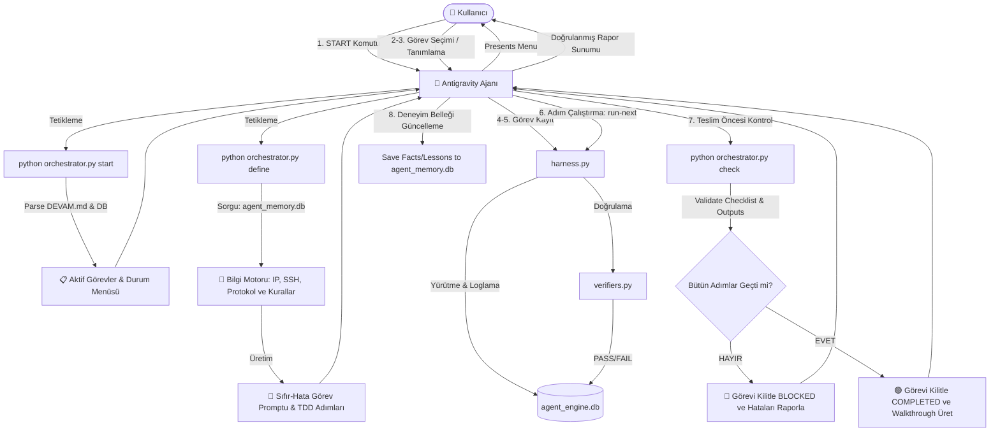

# Antigravity Task-Flow Engine (ATFE) - Mimari ve Çalışma Modeli

Bu belge, Antigravity workspace'i içerisinde geliştirilen **ATFE (Antigravity Task-Flow Engine)** eklentisinin/plugin yapısının tüm çalışma döngüsünü, bilgi motoru entegrasyonunu ve doğrulama süreçlerini detaylandırmaktadır.

---

## 📊 Süreç Akış Diyagramı (Mermaid)

Aşağıdaki diyagram, kullanıcının `START` komutundan başlayarak görevin tanımlanması, yürütülmesi ve teslim edilmesine kadar olan 8 aşamalı döngüyü göstermektedir:

---

## 🛠️ Adım Adım Çalışma Protokolü

### Adım 1: Başlangıç Tetiklemesi (`START`)
Kullanıcı chat ekranına **`START`** yazdığında ajan şu adımları işletir:
1.  Lokalde `python .engine/orchestrator.py start` komutunu çalıştırır.
2.  Orchestrator, `DEVAM.md` içerisindeki `🎯 SONRAKİ GÖREVLER` başlığı altındaki maddeleri ve `agent_engine.db` üzerindeki aktif görevleri okuyarak ajana temiz bir markdown menüsü sunar.
3.  Ajan, kullanıcıya mevcut durumu özetler ve seçenekleri sunar.

### Adım 2-3: Görev Tanımlama ve Konsept Analizi
Kullanıcı bir görevi seçtiğinde veya yeni bir talimat girdiğinde (Örn: *"Flash sunucusundaki SSH key sorununu çöz"*):
1.  Ajan, `python .engine/orchestrator.py define <task_id> "<görev_açıklaması>"` çalıştırır.
2.  **Bilgi Motoru (Knowledge Engine)** devreye girer:
    *   `.memory/agent_memory.db` veritabanındaki sunucu bilgilerini (IP, port, SSH anahtarları) çeker.
    *   Aktif protokol kurallarını (APOLLO V10, `CRON_CONTROL_PROTOCOL.md` vb.) okur.
    *   Tazminat/Dengeleme gibi kavramsal ve tarihsel uyarıları yükler.

### Adım 4-5: Sıfır-Hata Prompt Üretimi & Kayıt
1.  Orchestrator, toplanan bağlam ve kurallara dayanarak ajan için sıfır-hata standartlarında, adımlı ve her adımın sonunda çalışacak TDD doğrulama ifadelerini barındıran bir **çalışma planı (brief)** hazırlar.
2.  Ajan bu planı `harness.py add-step` komutları ile AEE (Agent Execution Engine) sistemine kaydeder.

### Adım 6: Yürütme ve Loglama (Execution Harness)
1.  Ajan, `python .engine/harness.py run-next <task_id>` ile adımları sırayla çalıştırır.
2.  Tüm terminal çıktıları (`stdout`, `stderr`), hata kodları veritabanına loglanır.
3.  Her adımın sonunda `verifiers.py` kütüphanesindeki ilgili doğrulama kodu otomatik olarak değerlendirilir.
4.  Eğer bir doğrulama başarısız olursa, ajan kendini **kilitler (BLOCKED)**. Hatayı düzeltip testi tekrar geçirmeden bir sonraki aşamaya geçmesi engellenir.

### Adım 7: Teslim Öncesi Son Kontrol (Checker Mode)
Ajan işi teslim etmeye kalkışmadan önce:
1.  `python .engine/orchestrator.py check <task_id>` komutunu çalıştırır.
2.  Checker motoru, istenen tüm adımların `COMPLETED` olup olmadığını kontrol eder.
3.  Değiştirilen dosyaların boyutlarını, Python syntax doğruluğunu ve varsa görsel çakışmaları bağımsız bir gözle test eder.
4.  Sadece **GREEN LIGHT (🟢)** alındığında ajan işi teslim etme hakkı kazanır.

### Adım 8: Deneyim ve Bilgi Belleği (Memory Log)
İş başarıyla tamamlandığında:
1.  Ajan, edinilen tecrübeleri, yapılan düzeltmeleri ve değişen sunucu/bot parametrelerini `.memory/agent_memory.db` içindeki `facts` ve `optimizations` tablolarına kaydeder.
2.  Böylece bir sonraki oturumda model "demans" (hafıza kaybı) yaşamadan geçmiş deneyimlerine göre hareket eder.
